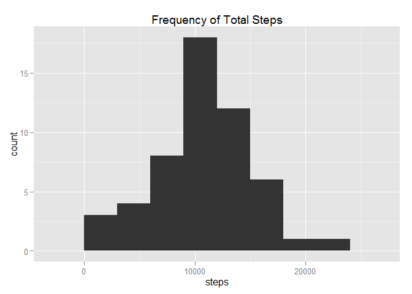
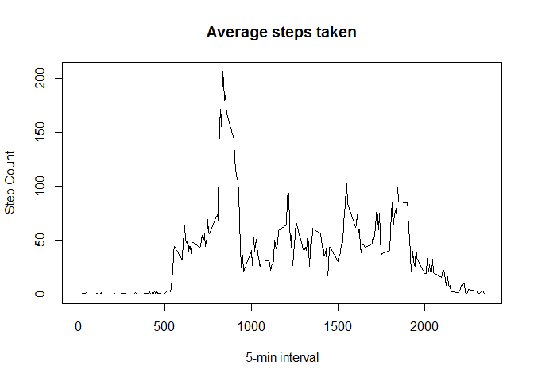
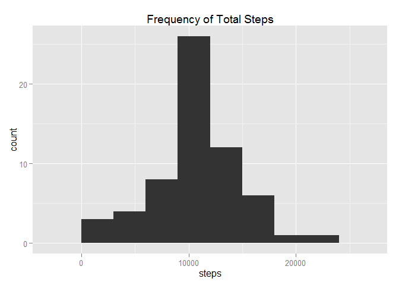
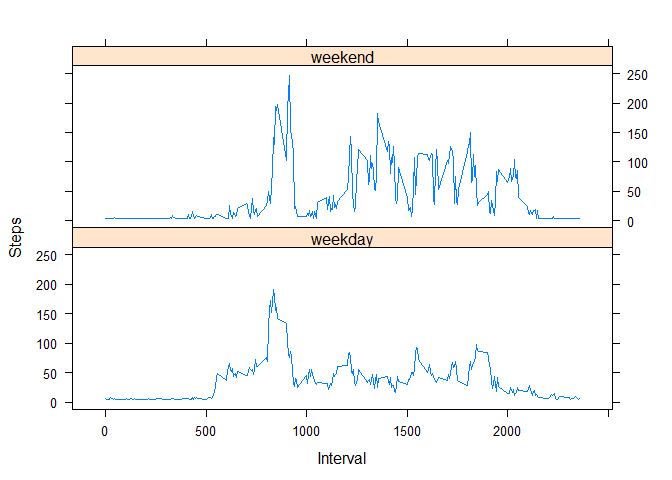

Reproducible Research Peer Assessment 1
======================================

Read in the data and transform the date to correct format:

```r
library(lattice)
library(knitr)
library(ggplot2)
activityData <- read.csv("activity.csv", header=TRUE)
activityData$date <- as.Date(activityData$date, "%Y-%m-%d")
```

###What is mean total number of steps taken per day?

Calculate total number of steps taken per day:

```r
library(plyr)
stepsperDate <- aggregate(steps ~ date, activityData, sum)
```

Make a histogram of the total number of steps taken per day:

```r
stepsPlot <- ggplot(stepsperDate, aes(x=steps))
stepsPlot + geom_histogram(binwidth=3000) + ggtitle("Frequency of Total Steps")
```

 

Calculate and report the mean and median of the total steps taken per day:

```r
stepsMean <- mean(stepsperDate$steps)
stepsMedian <- median(stepsperDate$steps)
stepsMean
```

```
## [1] 10766.19
```

```r
stepsMedian
```

```
## [1] 10765
```

###What is the average daily activity pattern?

Make a time series plot of the 5-minute interval and the average number of steps taken, averaged across all days:

```r
stepsInterval <- tapply(activityData$steps, activityData$interval, mean, na.rm=TRUE)
```


```r
plot(row.names(stepsInterval), stepsInterval, type = "l", xlab = "5-min interval",
     ylab = "Step Count", main = "Average steps taken")
```

 


```r
maxInterval <- which.max(stepsInterval)
names(maxInterval)
```

```
## [1] "835"
```

The max number of steps taken is 835.

###Inputing missing values


```r
activityNA <- sum(is.na(activityData))
```

There are 2304 missing values.

Replace NA values with mean for steps taken:

```r
library(Hmisc)
```

```
## Loading required package: grid
## Loading required package: survival
## Loading required package: Formula
## 
## Attaching package: 'Hmisc'
## 
## The following objects are masked from 'package:plyr':
## 
##     is.discrete, summarize
## 
## The following objects are masked from 'package:base':
## 
##     format.pval, round.POSIXt, trunc.POSIXt, units
```

```r
activityFull <- activityData
activityFull$steps <- impute(activityData$steps, fun=mean)
```

Create a plot of the steps taken with the new dataset:

```r
stepsDate <- aggregate(steps ~ date, activityFull, sum)
```


```r
stepsPlot2 <- ggplot(stepsDate, aes(x=steps))
stepsPlot2 + geom_histogram(binwidth=3000) + ggtitle("Frequency of Total Steps")
```

 

Calculate the mean and median of the steps taken with the new dataset:

```r
mean(stepsDate$steps)
```

```
## [1] 10766.19
```

```r
median(stepsDate$steps)
```

```
## [1] 10766.19
```

###Are there differences in activity between weekdays and weekends?

Create a new factor variable to split dates into weekend or weekday:

```r
activityFull <- mutate(activityFull, dayType = as.factor(ifelse(weekdays(date) %in% 
                                                          c("Saturday", "sunday"),
                                                      "weekend", "weekday")))
```

Plot average steps based on weekday vs weekend:

```r
stepWeek <- aggregate(steps ~ interval + dayType, activityFull, mean)
```


```r
xyplot(steps ~ interval | dayType, stepWeek, type = "l", layout = c(1, 2),
       xlab = "Interval", ylab = "Steps")
```

 
